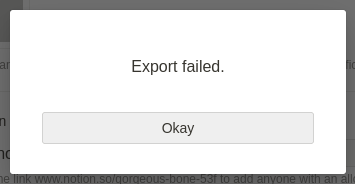

# N2O
[Notion](https://notion.so) is an incredibly useful tool to organize, take notes, and increase productivity. It is packed with features and is quite beginner friendly.

It is also a slow, glitchy, unreliable mess and a privacy nightmare. 

After being burned by Notion one too many times, I've decided to switch to the less functional but much more reliable and private [Obsidian](https://obsidian.md/) for at least some of my needs. This means migrating all my data over, which is a problem due to the long ID strings in the exported Notion data, along with other differences between the two tools. These are a few scripts to automate some of the pain away.

> The worst case scenario: your data is locked on a server and the export function fails. Customer service is no help.

## DeNotion
- Removes the ID strings at the end of Notion file and directory names, and updates the internal links in all files to match.
- Preserves traditional Markdown links ``, unlike existing tools (including one recommended by Obsidian), which tend to convert links into the Obsidian style `[]`.

## N2OKanban
- Parses a Notion directory that is from a Kanban board and generates an Obsidian Kanban board file (for use with the Kanban community plugin).

Neither of these are perfect: written in a hurry so instructions may be unclear, and any files with unusual characters in their names will cause problems that would have to be manually fixed, but it's worth it if it means getting away from proprietary crap.